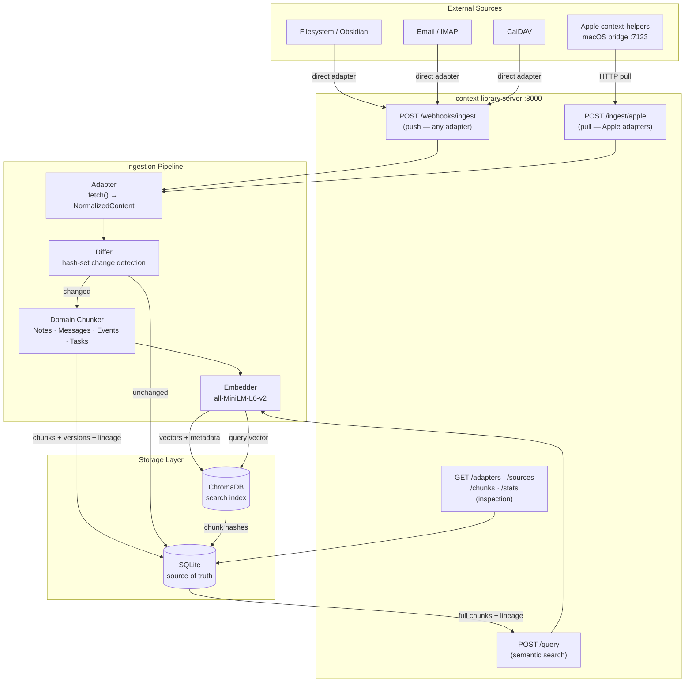
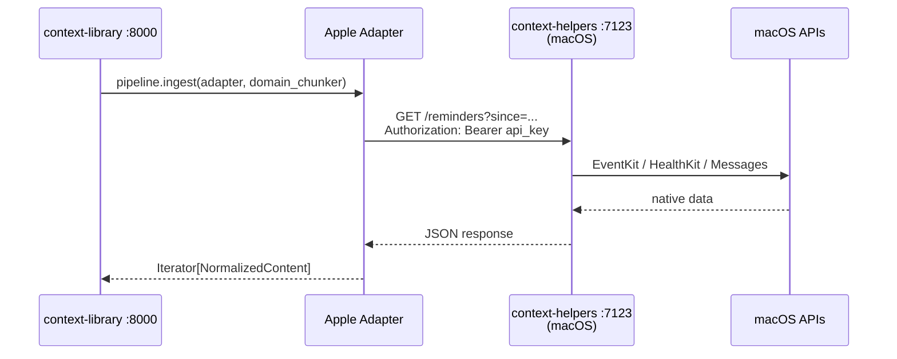
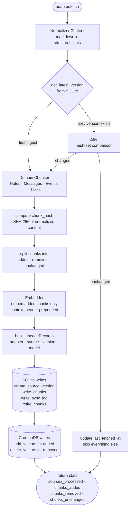
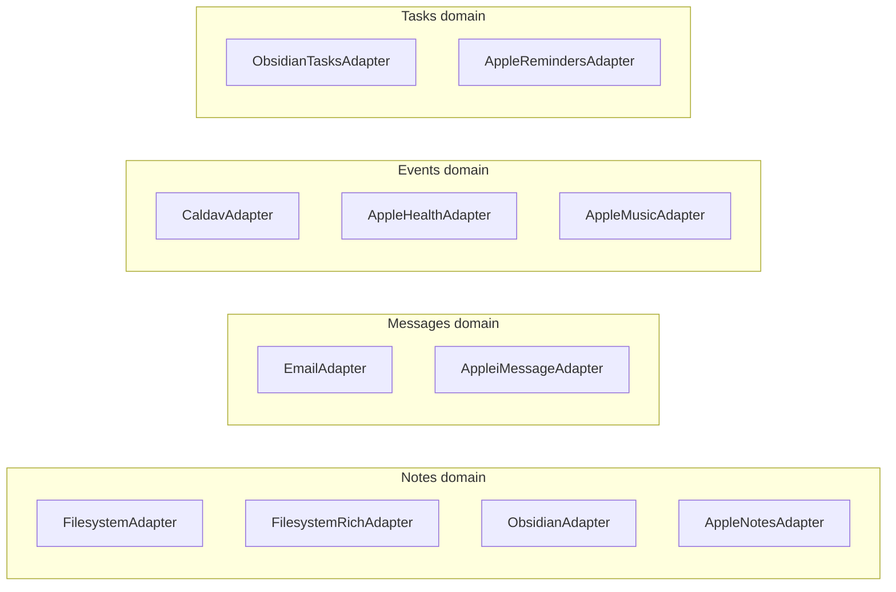
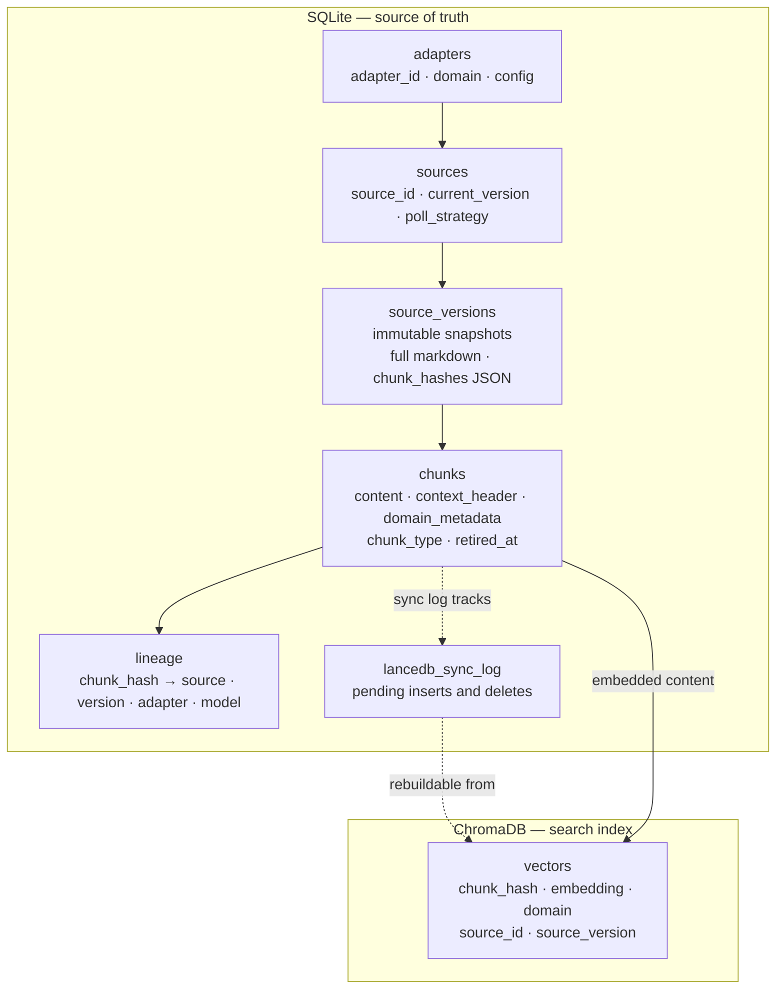
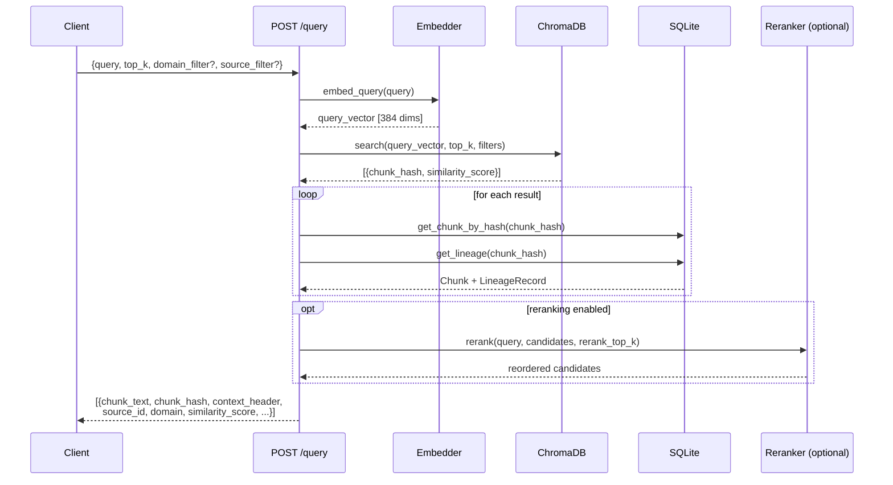
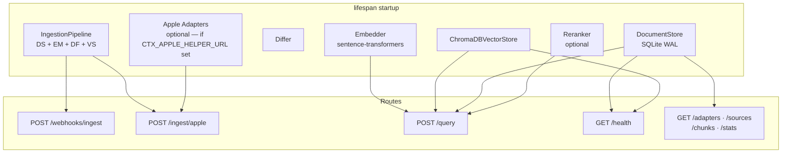

# Architecture

Context Library is a versioned RAG (retrieval-augmented generation) pipeline. Every piece of ingested content is normalized to markdown, chunked according to its semantic domain, embedded, and stored in two complementary stores. Re-ingestion detects changes at the chunk level using content hashes, so only genuinely new or modified chunks are re-embedded.

---

## System Topology



---

## Adapter Layer

Every content source is an adapter. Adapters implement a single contract and declare which semantic domain they belong to. The domain declaration is what determines chunking strategy — an adapter that produces email never needs to know how email is chunked.

### BaseAdapter contract

```python
class BaseAdapter(ABC):
    adapter_id: str          # deterministic, unique across all instances
    domain: Domain           # MESSAGES | NOTES | EVENTS | TASKS
    normalizer_version: str  # bump when normalization logic changes
    poll_strategy: PollStrategy  # PUSH | PULL | WEBHOOK

    def fetch(source_ref: str) -> Iterator[NormalizedContent]: ...
    def register(document_store: DocumentStore) -> str: ...
```

`fetch()` is a generator — it yields one `NormalizedContent` per logical source (e.g., one per file, one per email thread). Each yielded item carries a `source_id`, a markdown string, and `StructuralHints` (boolean flags for headings, lists, tables, and an array of natural boundary positions).

### Implemented adapters

| Adapter | Domain | Poll strategy | Source |
|---|---|---|---|
| `FilesystemAdapter` | Notes | Pull | Local `.md` files |
| `FilesystemRichAdapter` | Notes | Pull | PDF, Office, images via MarkItDown |
| `ObsidianAdapter` | Notes | Pull | Obsidian vault (frontmatter, wikilinks) |
| `ObsidianTasksAdapter` | Tasks | Pull | Obsidian Tasks plugin |
| `EmailAdapter` | Messages | Pull | IMAP via EmailEngine REST API |
| `CaldavAdapter` | Events | Pull | CalDAV calendars |
| `AppleRemindersAdapter` | Tasks | Pull | macOS context-helpers bridge |
| `AppleHealthAdapter` | Events | Pull | macOS context-helpers bridge |
| `AppleiMessageAdapter` | Messages | Pull | macOS context-helpers bridge |
| `AppleNotesAdapter` | Notes | Pull | macOS context-helpers bridge |
| `AppleMusicAdapter` | Events | Pull | macOS context-helpers bridge |

### Adapter class hierarchy

```mermaid
classDiagram
    class BaseAdapter {
        <<abstract>>
        +adapter_id str
        +domain Domain
        +normalizer_version str
        +poll_strategy PollStrategy
        +fetch(source_ref) Iterator~NormalizedContent~
        +register(document_store) str
    }

    class FilesystemAdapter { +directory Path }
    class FilesystemRichAdapter { +directory Path }
    class ObsidianAdapter { +vault_path Path }
    class ObsidianTasksAdapter { +vault_path Path }
    class EmailAdapter { +emailengine_url str; +account_id str }
    class CaldavAdapter { +caldav_url str }

    class AppleRemindersAdapter { +api_url str; +api_key str }
    class AppleHealthAdapter { +api_url str; +api_key str; +activity_type str }
    class AppleiMessageAdapter { +api_url str; +api_key str }
    class AppleNotesAdapter { +api_url str; +api_key str }
    class AppleMusicAdapter { +api_url str; +api_key str }

    FilesystemAdapter --|> BaseAdapter
    FilesystemRichAdapter --|> BaseAdapter
    ObsidianAdapter --|> BaseAdapter
    ObsidianTasksAdapter --|> BaseAdapter
    EmailAdapter --|> BaseAdapter
    CaldavAdapter --|> BaseAdapter
    AppleRemindersAdapter --|> BaseAdapter
    AppleHealthAdapter --|> BaseAdapter
    AppleiMessageAdapter --|> BaseAdapter
    AppleNotesAdapter --|> BaseAdapter
    AppleMusicAdapter --|> BaseAdapter
```



---

## macOS Bridge Pattern

Apple data sources (Reminders, Health, iMessage, Notes, Music) require native macOS APIs that cannot run in Docker. The companion [`context-helpers`](../context-helpers) service runs on macOS, exposes those sources over a local HTTP API, and context-library pulls from it at ingest time.



All five Apple adapters follow this pattern, varying only in the endpoint they call (`/reminders`, `/workouts`, `/messages`, `/notes`, `/tracks`) and the metadata they extract.

Configured via two environment variables on the context-library server:
- `CTX_APPLE_HELPER_URL` — base URL of the macOS bridge (e.g., `http://192.168.1.x:7123`)
- `CTX_APPLE_HELPER_API_KEY` — must match `server.api_key` in context-helpers `config.yaml`

If either variable is absent at startup, the Apple adapters are not registered and `POST /ingest/apple` returns a 404.

---

## Ingestion Pipeline

The `IngestionPipeline` in `core/pipeline.py` orchestrates the full flow. Each source is processed independently — a failure on one does not block others.



### Key pipeline invariants

**Context headers are embedded but not hashed.** Each chunk stores a `context_header` (e.g., the heading breadcrumb `# Section > ## Subsection` for a notes chunk, or `Subject — Sender` for a message). The embedding input is `context_header + "\n\n" + content`, but the SHA-256 hash is computed on `content` only. This means changing the heading of a section doesn't invalidate unchanged body chunks.

**Only added chunks are re-embedded.** Unchanged chunks carry their original `embedding_model_id` in the lineage record, so if the embedding model is swapped, old chunks are identifiable and can be selectively re-embedded.

**SQLite writes precede vector writes.** If the vector write fails after SQLite succeeds, `StorageError(inconsistent=True)` is raised. The `lancedb_sync_log` table records all pending inserts and deletes, so the vector store can be rebuilt from SQLite at any time.

---

## Domain Layer

The four domains encode semantic chunking knowledge. Every adapter declares one domain; the pipeline looks up the corresponding chunker via the domain registry.

```mermaid
classDiagram
    class BaseDomain {
        <<abstract>>
        +hard_limit int
        +chunk(content NormalizedContent) list~Chunk~
        #_split_if_needed(text) list~str~
        #_apply_cross_references(chunks) list~Chunk~
    }

    class NotesDomain {
        +soft_limit int
        Heading-based hierarchical chunking
        via mistune AST. Code blocks and
        tables are atomic. Context header
        is the heading breadcrumb path.
    }

    class MessagesDomain {
        Strips quoted replies. One chunk
        per message. Context header is
        subject and sender.
    }

    class EventsDomain {
        Time-window batching. Produces
        natural-language summaries of
        activity windows.
    }

    class TasksDomain {
        One chunk per task. Tracks
        lifecycle state transitions
        (open → in_progress → done).
    }

    NotesDomain --|> BaseDomain
    MessagesDomain --|> BaseDomain
    EventsDomain --|> BaseDomain
    TasksDomain --|> BaseDomain
```

### Domain → adapter mapping



---

## Dual Storage Architecture



**SQLite** stores everything: the full normalized markdown for every version, all chunk text, lineage records, and a sync log of pending vector operations. It is the authoritative record and can fully reconstruct the ChromaDB index.

**ChromaDB** stores only what is needed for similarity search: the embedding vector, chunk hash (join key back to SQLite), domain, source ID, and version. It is treated as disposable — if it diverges from SQLite, the sync log contains the operations needed to repair it.

### Content-addressed chunk identity

Chunks are identified by `SHA-256(normalize(content))`. Normalization collapses whitespace, strips trailing spaces per line, and normalizes line endings. The same logical content always produces the same hash regardless of which adapter, source, or version produced it — enabling cross-source deduplication and stable version diffing via set operations.

```
added   = curr_hashes − prev_hashes   → new chunks to embed and store
removed = prev_hashes − curr_hashes   → old chunks to retire and delete from vectors
unchanged = curr_hashes ∩ prev_hashes → carry forward, no re-embedding needed
```

### Consistency and recovery

| Failure point | Outcome | Recovery |
|---|---|---|
| Adapter fetch fails | `ChunkingError` logged; source skipped | Re-run ingest |
| SQLite write fails | `StorageError(inconsistent=False)` | Re-run ingest |
| ChromaDB write fails after SQLite succeeds | `StorageError(inconsistent=True)` logged | Replay `lancedb_sync_log` |
| All sources fail | `AllSourcesFailedError` raised | Check adapter config |
| ChromaDB fully lost | Rebuild from SQLite via sync log | Full re-embed |

---

## Retrieval Flow



Retrieval enriches vector search results with full chunk content and lineage from SQLite. Chunks that appear in the vector store but not SQLite (inconsistency) are skipped with a warning. Retired chunks are lazily cleaned up on read.

---

## SQLite Schema

```mermaid
erDiagram
    adapters {
        text adapter_id PK
        text domain
        text adapter_type
        text normalizer_version
        text config
    }

    sources {
        text source_id PK
        text adapter_id FK
        text domain
        text origin_ref
        text display_name
        int current_version
        datetime last_fetched_at
        text poll_strategy
        int poll_interval_sec
    }

    source_versions {
        text source_id PK_FK
        int version PK
        text markdown
        text chunk_hashes
        text adapter_id FK
        text normalizer_version
        datetime fetch_timestamp
    }

    chunks {
        text chunk_hash PK
        text source_id PK_FK
        int source_version PK_FK
        int chunk_index
        text content
        text context_header
        text domain
        text chunk_type
        text domain_metadata
        text parent_chunk_hash FK
        datetime retired_at
    }

    lancedb_sync_log {
        int id PK
        text chunk_hash
        text operation
        datetime synced_at
    }

    adapters ||--o{ sources : "registers"
    sources ||--o{ source_versions : "has"
    source_versions ||--o{ chunks : "contains"
    chunks ||--o{ chunks : "parent_chunk_hash"
    chunks ||--o{ lancedb_sync_log : "tracked by"
```

The composite primary key on `chunks` (`chunk_hash, source_id, source_version`) means the same content hash can exist across multiple sources and versions. The `parent_chunk_hash` self-reference enables version chain traversal — following ancestry from the current chunk back to its original form.

---

## Server Layer

The FastAPI server initializes all pipeline components during lifespan startup and stores them on `app.state` for route access. All blocking database and embedding operations are dispatched via `asyncio.to_thread`.



`POST /webhooks/ingest` and `POST /ingest/apple` both authenticate via a constant-time Bearer token comparison against `CTX_WEBHOOK_SECRET`. All read endpoints (`/adapters`, `/sources`, `/chunks`, `/stats`) are unauthenticated — place a reverse proxy with access controls in front if the server is internet-facing.
