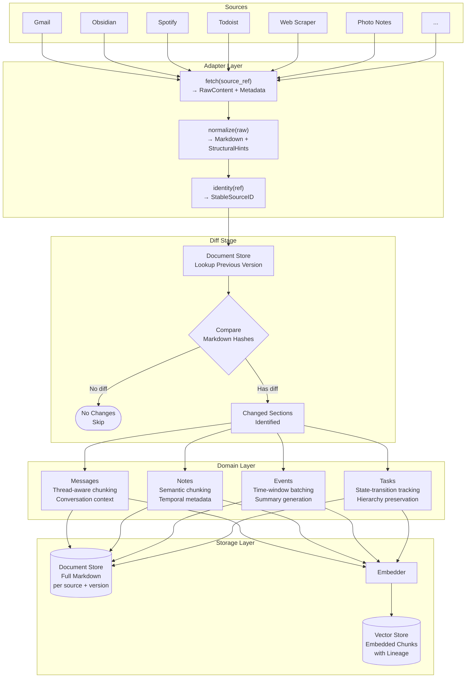
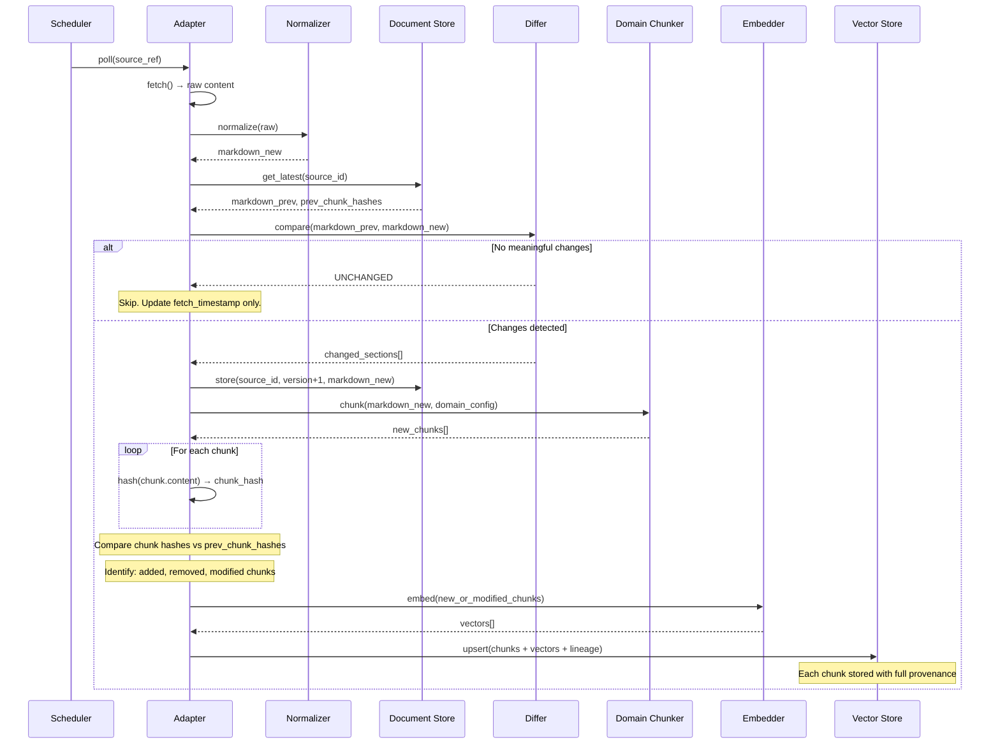
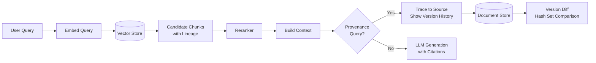
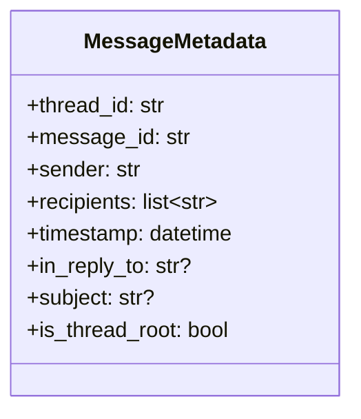
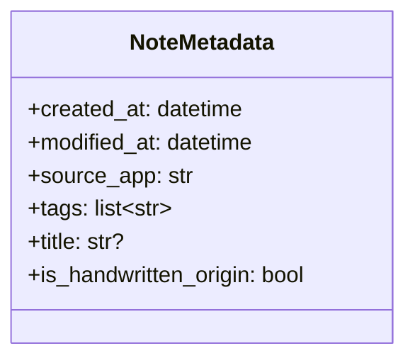
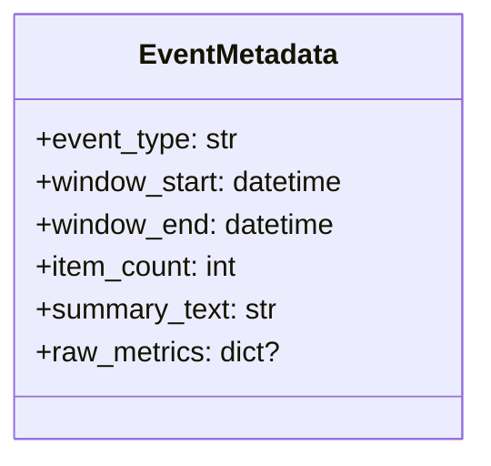
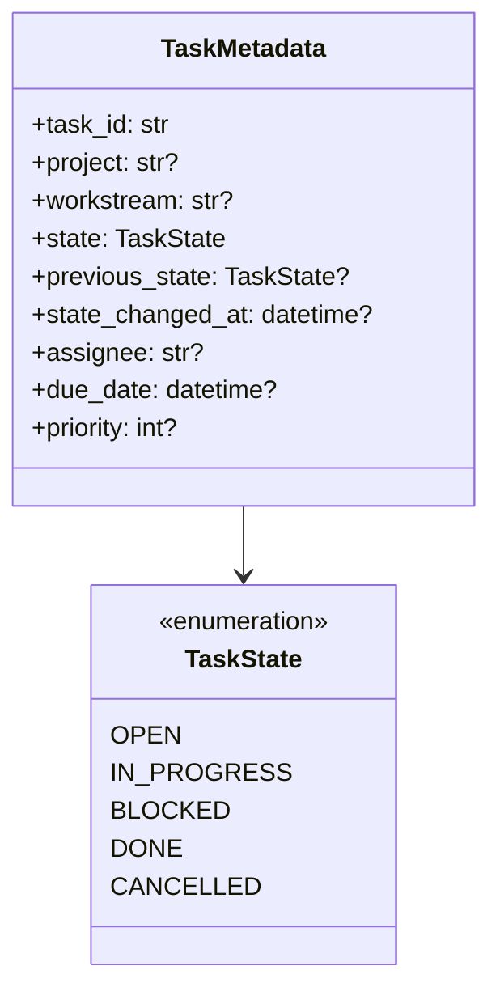

# Architecture

## Data Flow

### Ingestion Pipeline



### Re-ingestion & Version Detection



### Retrieval Flow



---

## Class Diagram

```mermaid
classDiagram
    direction TB

    class BaseAdapter {
        <<abstract>>
        +adapter_id: str
        +domain: Domain
        +normalizer_version: str
        +poll_strategy: PollStrategy
        +fetch(source_ref: str) Iterator~NormalizedContent~
        +register(document_store: DocumentStore) str
    }

    class PollStrategy {
        <<enumeration>>
        PUSH
        PULL
        WEBHOOK
    }

    class RawContent {
        +data: bytes
        +mime_type: str
        +metadata: SourceMetadata
    }

    class SourceMetadata {
        +source_id: SourceID
        +adapter_id: str
        +fetch_timestamp: datetime
        +origin_url: str?
        +extra: dict
    }

    class NormalizedContent {
        +markdown: str
        +structural_hints: StructuralHints
        +normalizer_version: str
    }

    class StructuralHints {
        +has_headings: bool
        +has_lists: bool
        +has_tables: bool
        +natural_boundaries: list~int~
    }

    BaseAdapter --> RawContent : produces
    BaseAdapter --> NormalizedContent : produces
    BaseAdapter --> PollStrategy : declares
    RawContent --> SourceMetadata : contains
    NormalizedContent --> StructuralHints : contains

    class GmailAdapter {
        +domain(): Messages
        +fetch(ref) RawContent
        +normalize(raw) NormalizedContent
    }

    class ObsidianAdapter {
        +domain(): Notes
        +fetch(ref) RawContent
        +normalize(raw) NormalizedContent
    }

    class SpotifyAdapter {
        +domain(): Events
        +fetch(ref) RawContent
        +normalize(raw) NormalizedContent
    }

    class TodoistAdapter {
        +domain(): Tasks
        +fetch(ref) RawContent
        +normalize(raw) NormalizedContent
    }

    class AppleRemindersAdapter {
        +domain: Tasks
        +fetch(source_ref) Iterator~NormalizedContent~
    }
    class AppleiMessageAdapter {
        +domain: Messages
        +fetch(source_ref) Iterator~NormalizedContent~
    }
    class AppleNotesAdapter {
        +domain: Notes
        +fetch(source_ref) Iterator~NormalizedContent~
    }
    class AppleHealthAdapter {
        +domain: Events
        +fetch(source_ref) Iterator~NormalizedContent~
    }
    class AppleMusicAdapter {
        +domain: Events
        +fetch(source_ref) Iterator~NormalizedContent~
    }
    class ObsidianAdapter {
        +domain: Notes
        +fetch(source_ref) Iterator~NormalizedContent~
    }
    class FilesystemAdapter {
        +domain: Notes
        +fetch(source_ref) Iterator~NormalizedContent~
    }

    GmailAdapter --|> BaseAdapter
    ObsidianAdapter --|> BaseAdapter
    SpotifyAdapter --|> BaseAdapter
    TodoistAdapter --|> BaseAdapter
    AppleRemindersAdapter --|> BaseAdapter
    AppleiMessageAdapter --|> BaseAdapter
    AppleNotesAdapter --|> BaseAdapter
    AppleHealthAdapter --|> BaseAdapter
    AppleMusicAdapter --|> BaseAdapter
    FilesystemAdapter --|> BaseAdapter

    class BaseDomain {
        <<abstract>>
        +domain_type: DomainType
        +chunk(content: NormalizedContent) list~Chunk~
        +enrich_metadata(chunk: Chunk) DomainMetadata
        +retrieval_context(chunks: list~Chunk~) str
    }

    class DomainType {
        <<enumeration>>
        MESSAGES
        NOTES
        EVENTS
        TASKS
    }

    class MessagesDomain {
        +chunk(content) list~Chunk~
        +enrich_metadata(chunk) MessageMetadata
        +reconstruct_thread(chunks) str
    }

    class NotesDomain {
        +chunk_size: int
        +chunk_overlap: int
        +chunk(content) list~Chunk~
        +enrich_metadata(chunk) NoteMetadata
    }

    class EventsDomain {
        +window_duration: timedelta
        +chunk(content) list~Chunk~
        +summarize_window(events) str
        +enrich_metadata(chunk) EventMetadata
    }

    class TasksDomain {
        +chunk(content) list~Chunk~
        +track_state_transition(prev, curr) StateChange
        +enrich_metadata(chunk) TaskMetadata
    }

    MessagesDomain --|> BaseDomain
    NotesDomain --|> BaseDomain
    EventsDomain --|> BaseDomain
    TasksDomain --|> BaseDomain
    BaseDomain --> DomainType : declares

    class Chunk {
        +chunk_hash: str
        +content: str
        +chunk_index: int
        +source_id: SourceID
        +source_version: int
        +domain: DomainType
        +domain_metadata: DomainMetadata
        +lineage: LineageRecord
    }

    class LineageRecord {
        +adapter_id: str
        +source_id: SourceID
        +source_version: int
        +fetch_timestamp: datetime
        +normalizer_version: str
        +domain: DomainType
        +chunk_hash: str
        +chunk_index: int
        +parent_chunk_hash: str?
    }

    class SourceVersion {
        +source_id: SourceID
        +version: int
        +markdown: str
        +chunk_hashes: set~str~
        +created_at: datetime
        +adapter_id: str
        +normalizer_version: str
    }

    class VersionDiff {
        +source_id: SourceID
        +from_version: int
        +to_version: int
        +added_hashes: set~str~
        +removed_hashes: set~str~
        +unchanged_hashes: set~str~
        +compute(prev: SourceVersion, curr: SourceVersion) VersionDiff
    }

    Chunk --> LineageRecord : carries
    BaseDomain --> Chunk : produces
    SourceVersion --> Chunk : contains hashes of
    VersionDiff --> SourceVersion : compares two

    class DocumentStore {
        +store(source_id, version, markdown, chunk_hashes)
        +get_latest(source_id) SourceVersion
        +get_version(source_id, version) SourceVersion
        +get_history(source_id) list~SourceVersion~
    }

    class VectorStore {
        +upsert(chunks: list~Chunk~, vectors: list~Vector~)
        +search(query_vector, top_k, filters) list~Chunk~
        +get_by_source(source_id) list~Chunk~
        +get_by_hash(chunk_hash) Chunk
        +retire(chunk_hashes: set~str~)
    }

    class Embedder {
        +model_id: str
        +embed(texts: list~str~) list~Vector~
        +embed_query(query: str) Vector
    }

    class Differ {
        +compare(prev_md: str, curr_md: str) DiffResult
        +is_meaningful(diff: DiffResult) bool
        -filter_whitespace_only(diff) DiffResult
        -filter_formatting_only(diff) DiffResult
    }

    class DiffResult {
        +changed: bool
        +changed_sections: list~str~
        +prev_hash: str
        +curr_hash: str
    }

    DocumentStore --> SourceVersion : stores
    VectorStore --> Chunk : indexes
    Embedder --> VectorStore : feeds
    Differ --> DiffResult : produces

    class Pipeline {
        +adapters: dict~str, BaseAdapter~
        +domains: dict~DomainType, BaseDomain~
        +document_store: DocumentStore
        +vector_store: VectorStore
        +embedder: Embedder
        +differ: Differ
        +ingest(source_ref: SourceRef, adapter_id: str)
        +reingest(source_id: SourceID)
        +query(text: str, filters: dict) list~Chunk~
        +version_diff(source_id, v1, v2) VersionDiff
    }

    Pipeline --> BaseAdapter : orchestrates
    Pipeline --> BaseDomain : delegates to
    Pipeline --> DocumentStore : reads/writes
    Pipeline --> VectorStore : reads/writes
    Pipeline --> Embedder : uses
    Pipeline --> Differ : uses

    class Scheduler {
        +register(adapter: BaseAdapter, sources: list~SourceRef~)
        +start()
        +stop()
        -poll_loop(adapter, source, interval)
        -handle_webhook(adapter, payload)
    }

    Scheduler --> Pipeline : triggers ingest
    Scheduler --> BaseAdapter : polls
```



---

## Domain Metadata Schemas

Each domain carries specialized metadata on its chunks beyond the common `LineageRecord`.

### Messages



### Notes



### Events



### Tasks



---

## Server Layer

The FastAPI server (`server/app.py`) exposes the ingestion pipeline over HTTP. Components are initialized in the lifespan context manager and stored on `app.state`:

| Endpoint | Description |
|---|---|
| `GET /health` | Service health and vector count |
| `POST /webhooks/ingest` | Push pre-normalized content from any adapter |
| `POST /ingest/apple` | Pull from all configured Apple helper adapters |
| `POST /query` | Semantic search with optional reranking |

All endpoints require `Authorization: Bearer <CTX_WEBHOOK_SECRET>`.

### macOS Bridge Pattern

Apple data sources (Reminders, iMessage, Notes, Health, Music) require native macOS APIs and cannot run in Docker. The companion `context-helpers` service runs on macOS, exposes those sources over HTTP on port 7123, and this server pulls from it via `POST /ingest/apple`.

```
macOS (context-helpers)                 Linux/Docker (context-library)
───────────────────────────             ──────────────────────────────
FastAPI :7123                           FastAPI :8000
  GET /reminders   ◄──────────────────  AppleRemindersAdapter
  GET /messages    ◄──────────────────  AppleiMessageAdapter
  GET /notes       ◄──────────────────  AppleNotesAdapter
  GET /workouts    ◄──────────────────  AppleHealthAdapter
  GET /tracks      ◄──────────────────  AppleMusicAdapter
```

Configured via `CTX_APPLE_HELPER_URL` and `CTX_APPLE_HELPER_API_KEY` (must match `server.api_key` in context-helpers `config.yaml`).

---

## Key Design Decisions

### Why hash-based versioning over positional?

Positional versioning ("chunk 3 of document X") breaks when documents are restructured — inserting a paragraph shifts everything. Content hashes are stable regardless of position. The tradeoff is that "what changed" becomes a set operation (diff the hash sets) rather than a direct lookup, but that's cheap and deterministic.

### Why dual storage (document store + vector store)?

The vector store is optimized for similarity search, not document reconstruction. Storing full normalized markdown separately means you can re-chunk, re-embed, or diff without re-fetching from origin. It also means the vector store can be treated as disposable — rebuild it from the document store at any time.

### Why "good enough" normalization?

Chasing perfect markdown reproducibility across adapter runs is an infinite yak-shave. Instead, the differ has simple heuristics (ignore whitespace-only changes, normalize heading levels) that catch the most common phantom diffs. When a normalizer bug causes false version bumps, it shows up as a detectable pattern (many sources bumping simultaneously) and can be fixed in the normalizer without data loss.

### Why four domains instead of a flat adapter registry?

Chunking strategy differs fundamentally across these categories. A chat message, a freeform note, a heart-rate reading, and a to-do item have nothing in common from a chunking perspective. The domain layer encodes that semantic knowledge once, and all adapters in that domain inherit it. Adding a new adapter means writing a fetch/normalize implementation, not reinventing chunking logic.
